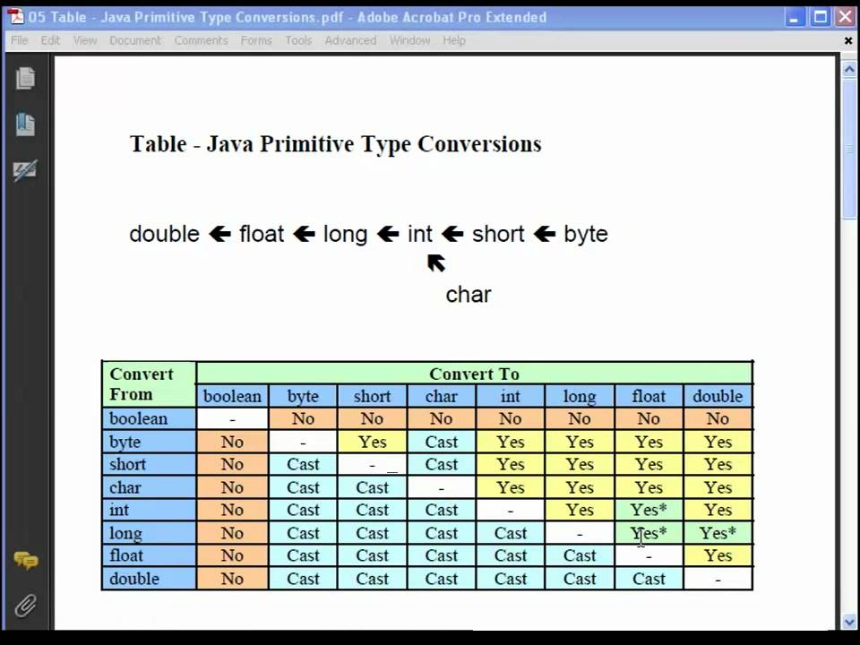

# Primitive Data types


Float = It follows single-precision (6-7 decimal digits).
Double = It follows double-precision (15-16 decimal digits).



```java
// do not need to cast
int a = 10;
double b = a;
System.out.println(b);
// Output :> 10.0

// need to cast
double i = 10.8;
int j = (int) i;
System.out.println(j);

// Output :> 10
// it will round off from 10.8 to 10
```

## What will happen if we increment int, byte, long by 1 from it's max value

```java
char maxChar = 65535;  // '\uffff'
maxChar++;  // Wraps to 0
char minChar = 0;      // '\u0000'
minChar--;  // Wraps to 65535

byte maxByte = 127;
maxByte++;  // Wraps to -128
byte minByte = -128;
minByte--;  // Wraps to 127

int maxInt = 2147483647;
maxInt++;  // Wraps to -2147483648
int minInt = -2147483648;
minInt--;  // Wraps to 2147483647

// Same for other primitive types

// For wrapper class
Character c = 65535;
c++;
System.out.println((int)c); // Wraps to 0

Character c = 0;
c--;
System.out.println((int)c); // Wraps to 65535
```

### diff between b++ or ++b and b = b + 1

```java
byte b = 127;
b++;        // Works fine
b = b + 1;  // Compilation error
b = (byte) b+1; // Works fine
```
#### b++ or ++b
- Java implicitly knows this operation will result in a byte
- The compiler handles the wrapping automatically

#### b = b+1;
- When you perform arithmetic operations, Java automatically promotes smaller data types
- In this case, maxByte is promoted to an int before addition
- So maxByte + 1 produces an int result
- Then you're trying to assign an int back to a byte without explicit casting
Hence the compilation error
